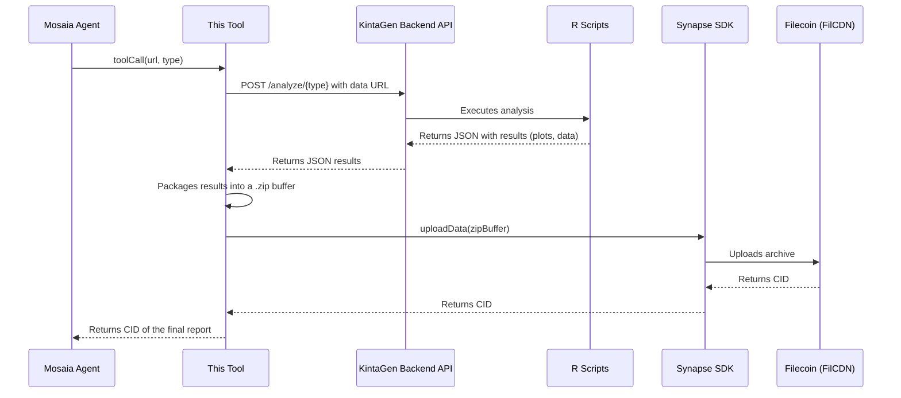

# KintaGen Scientific Analysis Tool for Mosaia

This repository contains a **Mosaia Tool** designed to act as a bridge between AI agents and complex, backend scientific analysis pipelines. It exposes powerful computational biology functions (like LD50 and GC-MS analysis) as a simple, callable tool that can be integrated into any Mosaia agent.

The tool's primary role is to:
1.  Receive a request from a Mosaia agent with a link to data on FilCDN.
2.  Call a dedicated KintaGen backend API to perform the heavy computation.
3.  Receive the multi-file results (plots, data tables).
4.  Package these results into a single, portable `.zip` archive.
5.  Upload the final archive to **Filecoin** via the **Synapse SDK**, returning the new CID.

## How It Works

This tool orchestrates a multi-step process, making it seamless for an AI agent to trigger and consume a complex analysis.



## Key Features

*   **Mosaia Tool Integration:** Exposes complex scientific analyses as a simple, callable function (`LD50-analysis-perform-test-scripts`) for AI agents, defined in `.mosaia`.
*   **Analysis Orchestration:** Calls a remote KintaGen API to perform computationally intensive LD50 (dose-response) and GC-MS (metabolomics) analyses.
*   **Automated Result Packaging:** Automatically collects all analysis outputs (plots, data tables) and packages them into a single, portable `.zip` archive using `archiver`.
*   **Decentralized Storage:** Uploads the final report archive directly to Filecoin via the **Synapse SDK**, making it permanently accessible and verifiable via FilCDN.

## 1. Prerequisites

| Tool | Version | Purpose |
| :--- | :--- | :--- |
| **Node.js** | ≥ 20 LTS | JavaScript Runtime |
| **pnpm** | ≥ 8 | Recommended Package Manager |

## 2. Setup & Installation

1.  **Clone the repository:**
    ```bash
    git clone https://github.com/KintaGen/kintagen-tool-template.git
    cd kintagen-tool-template
    ```

2.  **Install dependencies:**
    ```bash
    pnpm install
    ```

## 3. Environment Variables

This tool requires environment variables for connecting to the backend API and the Filecoin network.

1.  Copy the example file:
    ```bash
    cp .env.example .env
    ```
2.  Fill in the values in the newly created `.env` file:

| Variable | Description | Example |
| :--- | :--- | :--- |
| `API_URL` | The base URL of the KintaGen backend API that runs the R scripts. | `http://localhost:3001/api` |
| `SYNAPSE_PRIVATE_KEY` | Your **0x-prefixed** private key for a Filecoin wallet (e.g., from Glif). | `0x...` |
| `SYNAPSE_NETWORK` | The target Filecoin network. | `calibration` |
| `SYNAPSE_RPC_URL` | The RPC endpoint for the specified Filecoin network. | `https://api.calibration.node.glif.io/rpc/v1` |

## 4. Running Locally for Development

The project includes a simple Express server to simulate requests from the Mosaia platform, allowing for easy local testing.

1.  **Start the development server:**
    ```bash
    pnpm start:dev
    ```
    This will build the TypeScript code and start the server on `http://localhost:3000`.

2.  **Test the tool using the provided scripts:**
    Open a **new terminal** and run one of the test requests defined in `package.json`.

    *   **To test LD50 Analysis:**
        ```bash
        pnpm test:request:ld50
        ```
    *   **To test GC-MS Analysis:**
        ```bash
        pnpm test:request:gcms
        ```
    You will see detailed logs in the server terminal and receive a final JSON response containing the CID of the generated report on Filecoin.

## 5. Deployment to Mosaia

This tool is designed for easy deployment on the Mosaia platform.

1.  **Customize the Manifest:** Edit the `.mosaia` file to accurately describe your tool's name, description, and schema.
2.  **Install the GitHub App:** Connect your forked repository to the Mosaia GitHub app to enable automated deployments.
3.  **Push to `main`:** Pushing your changes to the `main` branch will automatically trigger a new build and deployment on Mosaia. Your updated tool will appear in your Mosaia user profile.
4.  **Add to an Agent:** Once deployed, you can add the tool to any of your Mosaia agents and invoke it by name.

## 6. Project Structure

```plaintext
.
├── .mosaia              # Manifest file for the Mosaia platform
├── bin/
│   └── dev.js           # Local Express server for testing
├── src/
│   ├── index.ts         # Main serverless handler function
│   └── tool-call.ts     # Core orchestration logic
├── .env.example         # Template for environment variables
├── package.json         # Project scripts and dependencies
└── tsconfig.json        # TypeScript configuration
```

## License

Distributed under the MIT License. See `LICENSE` for more information.
